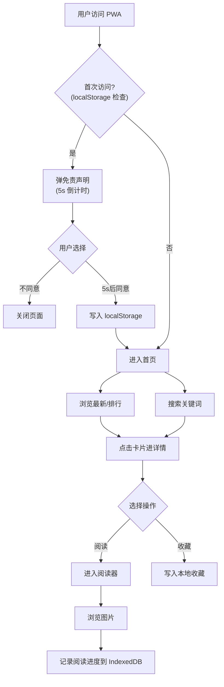

# 本子天国 PWA - 产品需求文档

## 1. 产品概述

本子天国 PWA 是 JMReader Android 客户端的 iOS 替代方案，通过网页技术让 iOS 用户无需越狱、无需 Apple Developer 账号即可使用本子天国全部核心功能。用户用 Safari 打开网址 → 分享 → 添加到主屏幕，即可像原生 App 一样使用，拥有独立图标、全屏体验、离线缓存。

- **解决问题**：iOS 用户无法安装 APK，App Store 严禁此类内容，PWA 是唯一可行的低成本分发方式
- **目标用户**：iOS 用户（及任何现代浏览器用户），需能访问 Cloudflare 与禁漫服务器
- **市场价值**：覆盖 iOS 用户群体，零上架成本，更新即时生效（无需重新分发）

## 2. 核心功能

### 2.1 用户角色

| 角色 | 注册方式 | 核心权限 |
|------|---------|---------|
| 访客 | 无需注册 | 浏览、搜索、阅读、本地收藏、屏蔽词 |
| 登录用户 | 禁漫账号登录 | 上述全部 + 服务端收藏同步 |

### 2.2 功能模块

1. **首页**：最新列表、排行切换（周/月/总）、分类筛选、漫画卡片网格、无限滚动
2. **搜索页**：关键词搜索、本子号直跳、4 种排序、搜索历史
3. **详情页**：漫画信息、章节列表、本地+服务端收藏、阅读入口、继续阅读
4. **阅读器**：图片上下滚动浏览、章节切换、阅读进度记忆、图片懒加载
5. **收藏页**：本地收藏与服务端收藏切换、网格展示、点击移除
6. **设置页**：主题切换、Worker 代理地址、屏蔽词管理、关于、查看免责声明
7. **首次访问**：5 秒倒计时强制阅读免责声明，持久化同意状态

### 2.3 页面详情

| 页面名称 | 模块名称 | 功能描述 |
|---------|---------|---------|
| 首页 | 顶部 Tab | 最新 / 周榜 / 月榜 / 总榜 胶囊切换 |
| 首页 | 分类筛选 | 同人/单本/短篇/汉化/美漫等分类横向滚动条 |
| 首页 | 卡片网格 | 2 列瀑布流，封面+标题+作者，点击进详情 |
| 首页 | 无限滚动 | 距底部 200px 触发加载下一页 |
| 搜索页 | 搜索框 | 输入关键词或 JM 本子号，回车搜索 |
| 搜索页 | 排序选项 | 最新 / 观看 / 评论 / 图片数 4 选 1 |
| 搜索页 | 历史记录 | 最近 20 条搜索词，点击直接搜，长按删除 |
| 详情页 | 头部信息 | 大封面+模糊背景+标题+作者+标签+简介 |
| 详情页 | 章节列表 | 多章节可点击切换，单章节直接显示 |
| 详情页 | 操作按钮 | 收藏/取消收藏、开始阅读、继续阅读 |
| 阅读器 | 图片列表 | 上下滚动浏览，IntersectionObserver 懒加载 |
| 阅读器 | 章节切换 | 顶部上一步/下一步按钮，到底自动提示 |
| 阅读器 | 进度记忆 | 自动记录当前章节+滚动位置，下次继续 |
| 收藏页 | 来源切换 | 本地收藏 / 服务端收藏 Tab |
| 收藏页 | 列表展示 | 网格卡片，点击进详情，长按移除 |
| 设置页 | 主题 | 跟随系统 / 浅色 / 深色 三选一 |
| 设置页 | 代理地址 | Worker URL 输入框，留空用默认 |
| 设置页 | 屏蔽词 | 标签屏蔽、标题关键词屏蔽，列表增删 |
| 设置页 | 关于 | 版本号、查看免责声明、GitHub 仓库链接 |

## 3. 核心流程

用户首次访问 → 弹免责声明（5 秒倒计时强制阅读）→ 同意后写入 localStorage → 进入首页 → 浏览/搜索/阅读 → 操作记录写入 IndexedDB

## 4. 用户界面设计

### 4.1 设计风格

- **主色调**：暗色为主基调，深紫黑 `#1a1625` 背景 + 粉紫强调色 `#d946ef`，呼应"本子天国"主题
- **浅色模式**：暖白底 `#fdf6f8` + 紫粉渐变点缀
- **按钮风格**：圆角 12px，主操作用粉紫渐变填充，次操作用描边
- **字体**：标题用思源宋体（Noto Serif SC）显文化感，正文用思源黑体（Noto Sans SC）
- **布局**：移动优先单列，桌面端自动变 3-4 列，底部 Tab 导航
- **图标**：Material Symbols Rounded 风格，与 Android 版保持视觉一致
- **氛围**：渐变光晕背景、卡片柔和阴影、过渡动画 200ms ease-out

### 4.2 页面设计概览

| 页面名称 | 模块名称 | UI 元素 |
|---------|---------|---------|
| 首页 | 顶栏 | 标题"本子天国"宋体 + 主题切换图标按钮 |
| 首页 | Tab 切换 | 4 个胶囊按钮横向排列，选中态粉紫填充 |
| 首页 | 分类条 | 横向滚动 Chip，选中态描边变填充 |
| 首页 | 卡片网格 | 2 列瀑布流，封面圆角 12px，标题 2 行省略 |
| 详情页 | 头部 | 大封面 + 20px 模糊背景 + 居中标题 + 标签胶囊 |
| 阅读器 | 全屏 | 黑底，图片最大宽度居中，左右半屏点击翻章 |
| 收藏页 | 列表 | 与首页同卡片样式，长按弹出删除菜单 |
| 设置页 | 分组 | 圆角卡片分组，每行图标+标题+控件 |

### 4.3 响应式

- **移动优先**：iOS Safari 主要场景，单列布局
- **桌面端**：列表自动变 3-4 列，详情页头部变左右分栏
- **触摸优化**：点击区域 ≥ 44px，滑动惯性滚动 `-webkit-overflow-scrolling: touch`
- **安全区域**：适配 iPhone 刘海与底部 home bar，使用 `env(safe-area-inset-*)`
- **PWA 全屏**：添加到主屏幕后隐藏浏览器 UI，状态栏背景跟随主题

### 4.4 3D 场景指南

不适用。

## 5. PWA 特性要求

- **可安装**：manifest.json 配置完整，Safari "添加到主屏幕"后拥有独立图标与启动画面
- **离线可用**：Service Worker 缓存应用壳（HTML/CSS/JS），离线时可打开应用（数据需联网）
- **图标资源**：192x192、512x512 PNG 图标，含 maskable 版本
- **启动画面**：紫色渐变背景 + 应用名"本子天国"
- **显示模式**：`display: standalone`，隐藏浏览器 UI

## 6. 非功能性需求

- **性能**：首屏 LCP < 2s（图片 CDN 走 Worker 代理），列表滚动 60fps
- **兼容性**：iOS Safari 15+、Chrome 90+、Firefox 88+、Edge 90+
- **安全**：Worker 代理不存储任何用户数据，登录密码仅透传给禁漫 API
- **隐私**：所有用户数据（收藏、历史、设置）仅存于本地 IndexedDB，不上传任何服务器
- **可访问性**：色彩对比度 WCAG AA，所有交互元素可键盘聚焦
