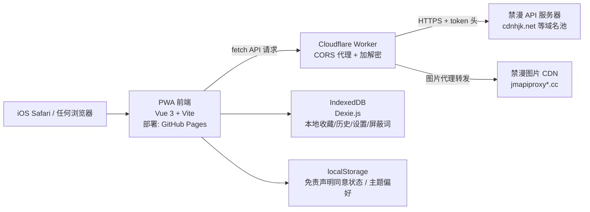
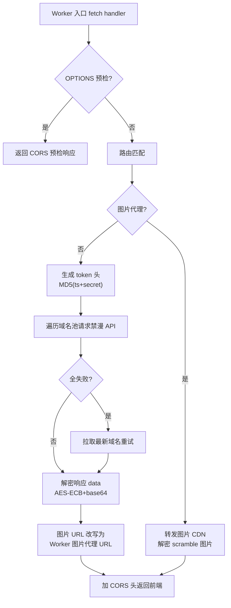
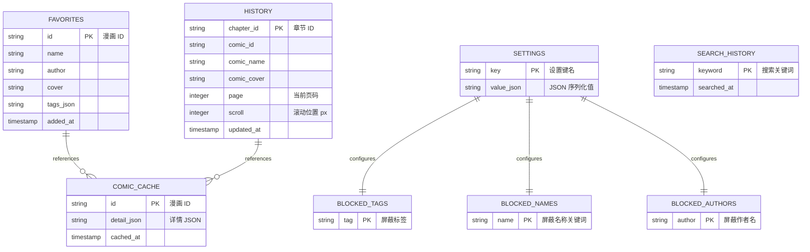

# 本子天国 PWA - 技术架构文档

## 1. 架构设计



**为什么需要 Worker 代理**：

1. **CORS 限制**：浏览器同源策略，PWA 部署在 `github.io` 无法直接请求禁漫 API（禁漫不返回 CORS 头）
2. **加密逻辑**：禁漫 API 需要 `token = md5(ts + secret)` 请求头，密钥不能暴露在客户端 JS 中（任何人可查看源码）
3. **响应解密**：响应 `data` 字段是 base64+AES-ECB 密文，需用 ts 解密
4. **图片代理**：禁漫图片 CDN 也有 CORS 限制，需 Worker 转发并加 CORS 头
5. **域名轮换**：禁漫 API 域名经常被封，Worker 端做域名池轮换重试，前端无感

## 2. 技术说明

- **前端框架**：Vue@3 + Vite@5 + TypeScript
- **PWA 插件**：vite-plugin-pwa（自动生成 manifest + service worker）
- **样式方案**：TailwindCSS@3 + 自定义 CSS 变量（主题切换）
- **路由**：Vue Router@4（history 模式，配 GitHub Pages 404 重定向技巧）
- **状态管理**：Pinia@2
- **本地存储**：Dexie.js（IndexedDB 封装，存收藏/历史/缓存/屏蔽词）
- **HTTP 客户端**：原生 fetch API + 自定义封装
- **初始化工具**：`npm create vite@latest jmtt-pwa -- --template vue-ts`
- **后端代理**：Cloudflare Worker（无需传统后端，无数据库）
- **图片加载**：IntersectionObserver 懒加载 + Worker 代理
- **部署平台**：GitHub Pages（前端）+ Cloudflare Workers（代理）

## 3. 路由定义

| 路由 | 用途 |
|------|------|
| `/` | 首页（最新/排行/分类） |
| `/search` | 搜索页 |
| `/comic/:id` | 漫画详情页 |
| `/reader/:chapterId` | 阅读器（全屏） |
| `/favorites` | 收藏列表 |
| `/settings` | 设置页 |
| `/about` | 关于页（含免责声明查看） |

## 4. API 定义

### 4.1 Cloudflare Worker 代理接口

Worker 转发所有禁漫 API，统一加 CORS 头并解密响应。前端只调用 Worker，不直接访问禁漫。

#### TypeScript 类型定义

```typescript
// 通用响应（Worker 返回给前端的统一格式）
interface ApiResponse<T> {
  code: number;        // 200=成功，其他=错误
  data: T | null;
  errorMsg: string | null;
}

// 漫画简要信息（列表项）
interface ComicBrief {
  id: string;
  name: string;
  author: string | null;
  tags: string[];
  cover: string | null;       // 已拼装好的 Worker 图片代理 URL
  likes: string | null;
  views: string | null;
}

// 分页结果
interface PageResult<T> {
  page: number;
  total: number | null;
  items: T[];
}

// 漫画详情
interface ComicDetail {
  id: string;
  name: string;
  author: string | null;
  description: string | null;
  tags: string[];
  cover: string | null;
  likes: string | null;
  views: string | null;
  chapters: Chapter[];
}

interface Chapter {
  id: string;
  title: string;
  sort: number;
}

interface ChapterImages {
  id: string;
  title: string | null;
  scramble_id: string;
  images: string[];   // 已拼装好的 Worker 图片代理 URL 数组
}

// 登录请求
interface LoginRequest {
  username: string;
  password: string;
}

interface SimpleResult {
  success: boolean;
  message: string | null;
}
```

#### Worker 端点定义

| 路径 | 方法 | Query 参数 | 用途 |
|------|------|-----------|------|
| `/api/health` | GET | - | Worker 健康检查 |
| `/api/latest` | GET | `page`, `category` | 最新列表 |
| `/api/ranking` | GET | `time`(all/today/week/month), `category`, `page` | 排行榜 |
| `/api/search` | GET | `q`, `page`, `order`(latest/views/likes/picture), `time` | 搜索 |
| `/api/comic/:id` | GET | - | 漫画详情（含章节列表） |
| `/api/chapter/:id` | GET | - | 章节图片列表 |
| `/api/favorites` | GET | `page` | 服务端收藏列表（需登录态） |
| `/api/favorite/:id` | POST | - | 添加服务端收藏 |
| `/api/favorite/:id` | DELETE | - | 移除服务端收藏 |
| `/api/login` | POST | body: `{username, password}` | 登录 |
| `/api/logout` | POST | - | 登出 |
| `/api/image-proxy` | GET | `url`, `scramble_id` | 图片代理（绕过图片 CDN 的 CORS，并解码分割图） |

#### Worker 关键实现要点

1. **token 生成**：`token = md5(ts + APP_TOKEN_SECRET)`，`tokenparam = "ts,ver"`
2. **响应解密**：`data` 字段 base64 解码 → AES-ECB 解密（密钥由 ts 派生）→ JSON
3. **scramble_id 获取**：请求 `/chapter_view_template`（用 SECRET_2）解析 HTML 中的 `var scramble_id = (\d+);`
4. **图片解码**：scramble_id > 220980 的图片需要按 10x10 网格重排切片（在 Worker 中用 OffscreenCanvas 或返回原图让前端解码）
5. **域名池轮换**：内置 8 个 API 域名 + 6 个图片域名，失败自动切换
6. **动态域名更新**：定期从字节 CDN 拉取最新 API 域名列表
7. **CORS 头**：所有响应加 `Access-Control-Allow-Origin: *`（或限制为前端域名白名单）
8. **登录态**：禁漫返回的 AVS cookie 由 Worker 转发，前端不可见（Worker 端用 KV 存 session）

### 4.2 前端 API 客户端

```typescript
// src/api/client.ts
class ApiClient {
  private baseUrl: string;  // Worker URL，可在设置页配置

  async get<T>(path: string, params?: Record<string, string>): Promise<T>;
  async post<T>(path: string, body?: unknown): Promise<T>;
  async delete<T>(path: string): Promise<T>;
}

// 各业务接口封装
class JmApi {
  latest(page: number, category?: string): Promise<PageResult<ComicBrief>>;
  ranking(time: string, category: string, page: number): Promise<PageResult<ComicBrief>>;
  search(q: string, page: number, order: string, time: string): Promise<PageResult<ComicBrief>>;
  comicDetail(id: string): Promise<ComicDetail>;
  chapterImages(id: string): Promise<ChapterImages>;
  favorites(page: number): Promise<PageResult<ComicBrief>>;
  addFavorite(id: string): Promise<SimpleResult>;
  removeFavorite(id: string): Promise<SimpleResult>;
  login(username: string, password: string): Promise<SimpleResult>;
  logout(): Promise<SimpleResult>;
}
```

## 5. Worker 服务器架构



## 6. 数据模型（客户端 IndexedDB）

### 6.1 数据模型定义



### 6.2 数据定义（Dexie Schema）

```typescript
// src/db/database.ts
import Dexie, { Table } from 'dexie';

class JmDatabase extends Dexie {
  favorites!: Table<Favorite>;
  history!: Table<HistoryEntry>;
  settings!: Table<Setting>;
  blockedTags!: Table<{ tag: string }>;
  blockedNames!: Table<{ name: string }>;
  blockedAuthors!: Table<{ author: string }>;
  comicCache!: Table<{ id: string; detail: string; cached_at: number }>;
  searchHistory!: Table<{ keyword: string; searched_at: number }>;

  constructor() {
    super('jmtt-pwa');
    this.version(1).stores({
      favorites: 'id, added_at, name',
      history: 'chapter_id, comic_id, updated_at',
      settings: 'key',
      blockedTags: 'tag',
      blockedNames: 'name',
      blockedAuthors: 'author',
      comicCache: 'id, cached_at',
      searchHistory: 'keyword, searched_at',
    });
  }
}

const db = new JmDatabase();
export default db;
```

### 6.3 Settings 键定义

| key | 类型 | 默认值 | 说明 |
|-----|------|--------|------|
| `theme` | `'system'\|'light'\|'dark'` | `'system'` | 主题模式 |
| `workerUrl` | `string` | `''` | Worker 代理地址，空=用内置默认 |
| `disclaimerAccepted` | `boolean` | `false` | 免责声明同意状态 |
| `readerDirection` | `'vertical'\|'horizontal'` | `'vertical'` | 阅读方向 |
| `loginSession` | `{avs: string, uid: string} \| null` | `null` | 登录会话（Worker 返回的 token） |

## 7. 项目结构

```
jmtt-pwa/
├── public/
│   ├── icons/
│   │   ├── pwa-192.png
│   │   ├── pwa-512.png
│   │   └── maskable-512.png
│   └── favicon.ico
├── src/
│   ├── api/
│   │   ├── client.ts          # 通用 HTTP 客户端
│   │   ├── jm.ts              # 禁漫业务 API 封装
│   │   └── types.ts           # TypeScript 类型
│   ├── assets/
│   │   └── styles/
│   │       ├── main.css       # 全局样式 + Tailwind
│   │       └── themes.css     # 主题 CSS 变量
│   ├── components/
│   │   ├── ComicCard.vue      # 漫画卡片
│   │   ├── ComicGrid.vue      # 卡片网格
│   │   ├── DisclaimerDialog.vue  # 免责声明对话框
│   │   ├── LoadMore.vue       # 无限滚动触发器
│   │   ├── EmptyState.vue     # 空状态
│   │   └── ErrorState.vue     # 错误状态
│   ├── composables/
│   │   ├── useTheme.ts        # 主题管理
│   │   ├── useInfiniteScroll.ts  # 无限滚动
│   │   └── useSettings.ts     # 设置读写
│   ├── db/
│   │   ├── database.ts        # Dexie 初始化
│   │   └── repositories/      # 各表的数据访问层
│   │       ├── favorites.ts
│   │       ├── history.ts
│   │       ├── settings.ts
│   │       └── blocked.ts
│   ├── router/
│   │   └── index.ts           # Vue Router 配置
│   ├── stores/
│   │   ├── api.ts             # API 客户端 store
│   │   ├── favorites.ts       # 收藏状态
│   │   └── settings.ts        # 设置状态
│   ├── views/
│   │   ├── HomeView.vue       # 首页
│   │   ├── SearchView.vue     # 搜索页
│   │   ├── ComicDetailView.vue # 漫画详情
│   │   ├── ReaderView.vue     # 阅读器
│   │   ├── FavoritesView.vue  # 收藏页
│   │   ├── SettingsView.vue   # 设置页
│   │   └── AboutView.vue      # 关于页
│   ├── App.vue                # 根组件（含免责声明弹窗）
│   ├── main.ts                # 应用入口
│   └── vite-env.d.ts
├── worker/                    # Cloudflare Worker 源码
│   ├── src/
│   │   ├── index.ts           # Worker 入口
│   │   ├── crypto.ts          # token 生成 + 响应解密
│   │   ├── domains.ts         # 域名池管理
│   │   ├── imageProxy.ts      # 图片代理 + scramble 解码
│   │   └── routes.ts          # 路由定义
│   ├── wrangler.toml          # Cloudflare 部署配置
│   ├── package.json
│   └── tsconfig.json
├── .github/
│   └── workflows/
│       └── deploy.yml         # GitHub Actions 自动部署到 Pages
├── index.html
├── package.json
├── tsconfig.json
├── vite.config.ts             # Vite + PWA 插件配置
├── tailwind.config.js
├── postcss.config.js
├── .gitignore
├── LICENSE
└── README.md
```

## 8. 部署架构

### 8.1 前端部署（GitHub Pages）

1. 代码推送到 `main` 分支
2. GitHub Actions 自动构建（`npm run build`）
3. 构建产物部署到 GitHub Pages
4. 访问地址：`https://qinx21068-star.github.io/jmtt-pwa/`

### 8.2 Worker 部署（Cloudflare）

1. 安装 Wrangler CLI：`npm install -g wrangler`
2. 登录 Cloudflare：`wrangler login`
3. 进入 worker 目录：`cd worker`
4. 部署：`wrangler deploy`
5. 获得地址：`https://jmtt-proxy.<你的子域>.workers.dev`
6. 把这个地址填入 PWA 设置页的"代理地址"

### 8.3 路由模式适配

GitHub Pages 不支持 SPA history 模式的服务端重定向，使用 `createWebHashHistory()`（hash 路由）避免刷新 404。

## 9. 安全考虑

1. **密钥保护**：禁漫 API 密钥仅存在于 Worker 端，前端 JS 不可见
2. **CORS 白名单**：Worker 的 CORS 头限制为前端实际域名，防止被滥用
3. **登录态隔离**：禁漫 AVS cookie 由 Worker 端管理，前端只拿一个随机 session ID
4. **无数据上报**：PWA 不向任何第三方服务上报用户数据
5. **HTTPS 强制**：GitHub Pages 与 Cloudflare Workers 默认 HTTPS
6. **Worker 速率限制**：Cloudflare 免费额度每天 10 万次请求，足够个人使用

## 10. 性能优化

1. **路由懒加载**：所有 view 组件 `() => import('./views/xxx.vue')` 按需加载
2. **图片懒加载**：IntersectionObserver，仅加载可视区域 + 1 屏预加载
3. **Service Worker 缓存**：应用壳（HTML/CSS/JS/图标）缓存，离线可打开
4. **列表虚拟化**：长列表超过 200 项时启用虚拟滚动（vue-virtual-scroller）
5. **请求去重**：相同 URL 的并发请求自动去重，避免重复请求
6. **图片代理缓存**：Worker 端用 Cache API 缓存图片，减少对禁漫 CDN 的请求
